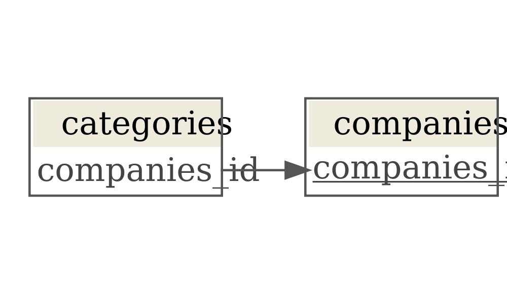

# Relational data with dplyr

``` r
library(tidyverse, warn.conflicts = FALSE)
#> ── Attaching packages ─────────────────────────────────────── tidyverse 1.3.2 ──
#> ✔ ggplot2 3.3.6     ✔ purrr   0.3.4
#> ✔ tibble  3.1.8     ✔ dplyr   1.0.9
#> ✔ tidyr   1.2.0     ✔ stringr 1.4.0
#> ✔ readr   2.1.2     ✔ forcats 0.5.1
#> ── Conflicts ────────────────────────────────────────── tidyverse_conflicts() ──
#> ✖ dplyr::filter() masks stats::filter()
#> ✖ dplyr::lag()    masks stats::lag()
```

[Relational data](https://r4ds.had.co.nz/relational-data.html):

-   A collection of related tables of data.
-   The relations are always defined between a pair of tables, by the
    keys.

<!-- -->

``` r
companies
#> # A tibble: 2 × 2
#>   companies_id information                               
#>          <dbl> <chr>                                     
#> 1            1 alpha sells solar panels and wind mills   
#> 2            2 beta sells steel and installs solar panels

categories
#> # A tibble: 4 × 2
#>   companies_id sector     
#>          <dbl> <chr>      
#> 1            1 energy     
#> 2            2 metallurgy 
#> 3            2 energy     
#> 4            3 agriculture

left_join(companies, categories, by = "companies_id")
#> # A tibble: 3 × 3
#>   companies_id information                                sector    
#>          <dbl> <chr>                                      <chr>     
#> 1            1 alpha sells solar panels and wind mills    energy    
#> 2            2 beta sells steel and installs solar panels metallurgy
#> 3            2 beta sells steel and installs solar panels energy
```

### Mutating joins

Add new variables to one data frame from matching observations in
another.

–

[Inner
join](https://r4ds.had.co.nz/relational-data.html#mutating-joins): Drop
unmatched rows.

``` r
inner_join(companies, categories, by = "companies_id")
#> # A tibble: 3 × 3
#>   companies_id information                                sector    
#>          <dbl> <chr>                                      <chr>     
#> 1            1 alpha sells solar panels and wind mills    energy    
#> 2            2 beta sells steel and installs solar panels metallurgy
#> 3            2 beta sells steel and installs solar panels energy
```

[Outter joins](https://r4ds.had.co.nz/relational-data.html#outer-join):

-   Keep all rows in `x`

``` r
# Most common
left_join(companies, categories, by = "companies_id")
#> # A tibble: 3 × 3
#>   companies_id information                                sector    
#>          <dbl> <chr>                                      <chr>     
#> 1            1 alpha sells solar panels and wind mills    energy    
#> 2            2 beta sells steel and installs solar panels metallurgy
#> 3            2 beta sells steel and installs solar panels energy
```

-   Keep all rows in `y`

``` r
left_join(companies, categories, by = "companies_id")
#> # A tibble: 3 × 3
#>   companies_id information                                sector    
#>          <dbl> <chr>                                      <chr>     
#> 1            1 alpha sells solar panels and wind mills    energy    
#> 2            2 beta sells steel and installs solar panels metallurgy
#> 3            2 beta sells steel and installs solar panels energy
```

-   Keep all rows in `x` and `y`

``` r
full_join(companies, categories, by = "companies_id")
#> # A tibble: 4 × 3
#>   companies_id information                                sector     
#>          <dbl> <chr>                                      <chr>      
#> 1            1 alpha sells solar panels and wind mills    energy     
#> 2            2 beta sells steel and installs solar panels metallurgy 
#> 3            2 beta sells steel and installs solar panels energy     
#> 4            3 <NA>                                       agriculture
```

-   [Duplicate
    keys](https://r4ds.had.co.nz/relational-data.html#join-matches)

``` r
# Duplicate keys in one table
companies2 = bind_rows(companies, tibble(companies_id = 1L, information = "abc"))
left_join(companies2, categories)
#> Joining, by = "companies_id"
#> # A tibble: 4 × 3
#>   companies_id information                                sector    
#>          <dbl> <chr>                                      <chr>     
#> 1            1 alpha sells solar panels and wind mills    energy    
#> 2            2 beta sells steel and installs solar panels metallurgy
#> 3            2 beta sells steel and installs solar panels energy    
#> 4            1 abc                                        energy

# Duplicate keys in both tables
categories2 = bind_rows(categories, tibble(companies_id = 1L, sector = "xyz"))
left_join(companies2, categories2)
#> Joining, by = "companies_id"
#> # A tibble: 6 × 3
#>   companies_id information                                sector    
#>          <dbl> <chr>                                      <chr>     
#> 1            1 alpha sells solar panels and wind mills    energy    
#> 2            1 alpha sells solar panels and wind mills    xyz       
#> 3            2 beta sells steel and installs solar panels metallurgy
#> 4            2 beta sells steel and installs solar panels energy    
#> 5            1 abc                                        energy    
#> 6            1 abc                                        xyz
```

### Filtering joins

Affect observations, not variables:

-   semi_join(x, y) keeps all observations in x that have a match in y.

``` r
semi_join(companies, categories)
#> Joining, by = "companies_id"
#> # A tibble: 2 × 2
#>   companies_id information                               
#>          <dbl> <chr>                                     
#> 1            1 alpha sells solar panels and wind mills   
#> 2            2 beta sells steel and installs solar panels
```

-   anti_join(x, y) drops all observations in x that have a match in y.

``` r
# Invalid foreign key
anti_join(categories, companies)
#> Joining, by = "companies_id"
#> # A tibble: 1 × 2
#>   companies_id sector     
#>          <dbl> <chr>      
#> 1            3 agriculture
```

### Validating keys to avoid [join problems](https://r4ds.had.co.nz/relational-data.html#join-problems)

-   All values of a primary key should be unique.

``` r
companies |>
  count(companies_id) |>
  filter(n > 1)
#> # A tibble: 0 × 2
#> # … with 2 variables: companies_id <dbl>, n <int>
#> # ℹ Use `colnames()` to see all variable names

# (!) The `companies_id` column is NOT a primary key of `categories`
categories |>
  count(companies_id) |>
  filter(n > 1)
#> # A tibble: 1 × 2
#>   companies_id     n
#>          <dbl> <int>
#> 1            2     2
```

-   No value of a primary key should be missing.

``` r
companies |> 
  filter(is.na(companies_id))
#> # A tibble: 0 × 2
#> # … with 2 variables: companies_id <dbl>, information <chr>
#> # ℹ Use `colnames()` to see all variable names
```

-   All values of a foreign key should match a value of a primary key.

``` r
# ! Problem
anti_join(categories, companies, by = "companies_id")
#> # A tibble: 1 × 2
#>   companies_id sector     
#>          <dbl> <chr>      
#> 1            3 agriculture
```
