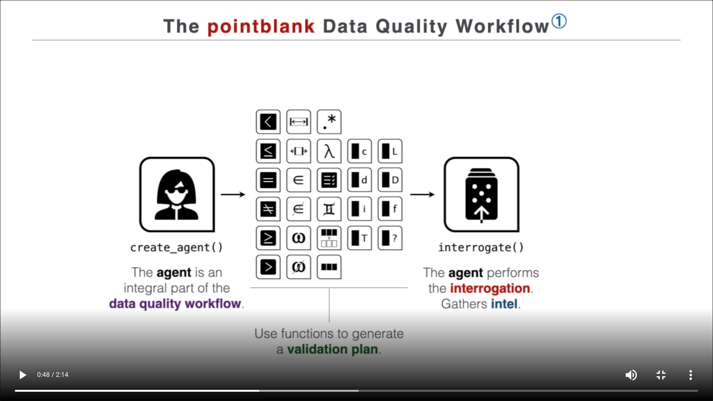
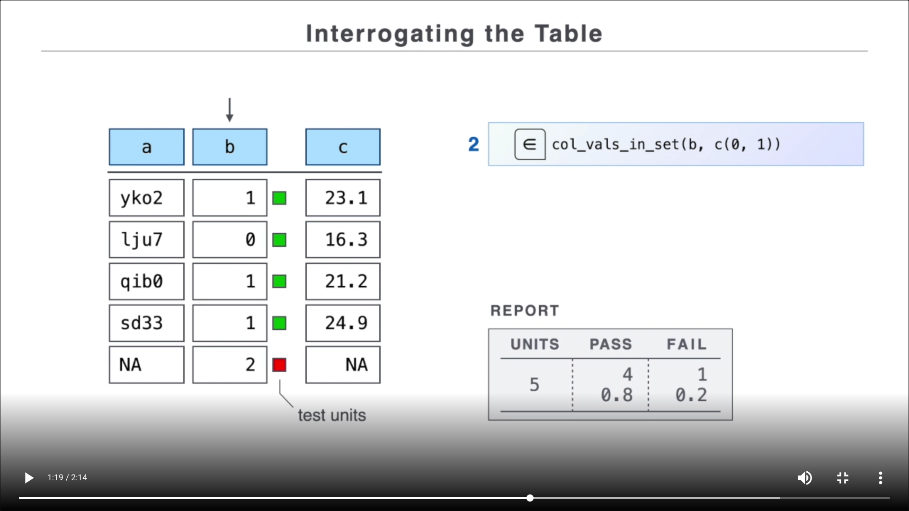
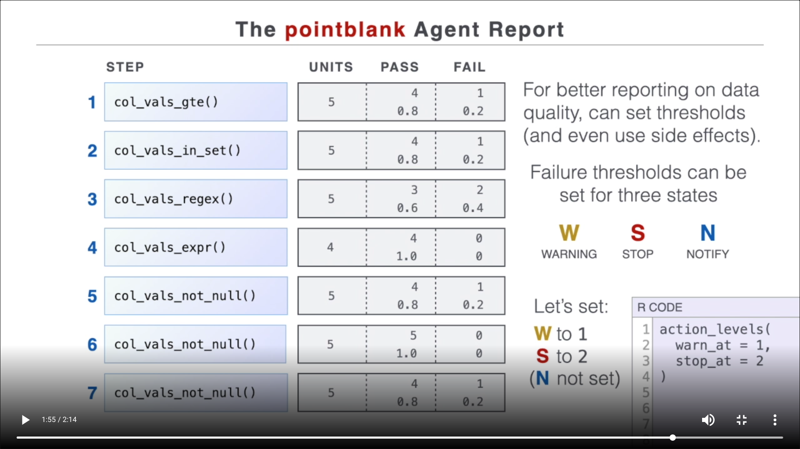
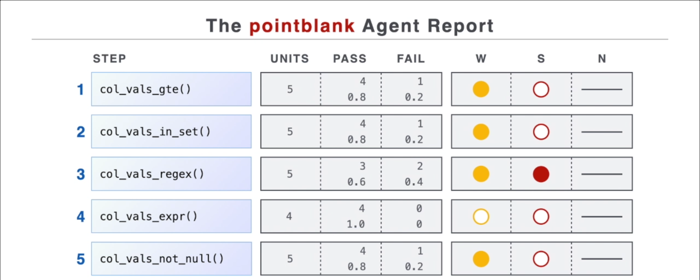
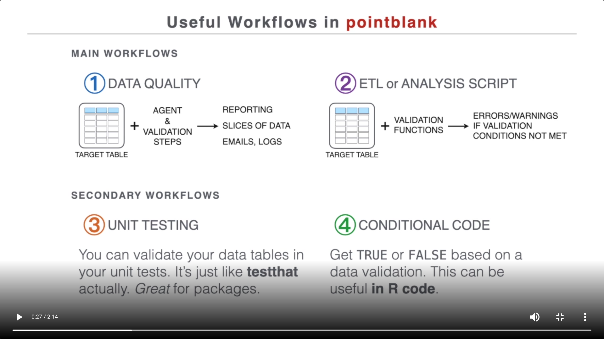

# Validating data quality with [pointblank](https://rich-iannone.github.io/pointblank/)

Overview



Example

``` r
library(pointblank)

data <- tibble::tibble(b = c(1, 0, 1, 1, 2))

data |> 
  create_agent() |> 
  col_vals_not_null(b) |> 
  col_vals_in_set(b, c(0, 1)) |>
  interrogate()
```

Detail



Action levels



``` r
data |> 
  create_agent(actions = action_levels(warn_at = 1, stop_at = 2)) |> 
  col_vals_not_null(b) |> 
  col_vals_in_set(b, c(0, 1)) |>
  interrogate()
```



[More](https://rich-iannone.github.io/pointblank/):

-   [More
    workflows](https://rich-iannone.github.io/pointblank/articles/validation_workflows.html)



``` r
data |> 
  create_agent(actions = action_levels(warn_at = 1, stop_at = 2)) |> 
  col_vals_not_null(vars(b)) |> 
  col_vals_in_set(vars(b), c(0, 1))
```

<div id="pb_agent" style="overflow-x:auto;overflow-y:auto;width:auto;height:auto;">
<style>@import url("https://fonts.googleapis.com/css2?family=IBM+Plex+Sans:ital,wght@0,100;0,200;0,300;0,400;0,500;0,600;0,700;0,800;0,900;1,100;1,200;1,300;1,400;1,500;1,600;1,700;1,800;1,900&display=swap");
@import url("https://unpkg.com/balloon-css/balloon.min.css");
html {
  font-family: 'IBM Plex Sans', -apple-system, BlinkMacSystemFont, 'Segoe UI', Roboto, Oxygen, Ubuntu, Cantarell, 'Helvetica Neue', 'Fira Sans', 'Droid Sans', Arial, sans-serif;
}

#pb_agent .gt_table {
  display: table;
  border-collapse: collapse;
  margin-left: auto;
  margin-right: auto;
  color: #333333;
  font-size: 90%;
  font-weight: normal;
  font-style: normal;
  background-color: #FFFFFF;
  width: auto;
  border-top-style: solid;
  border-top-width: 2px;
  border-top-color: #A8A8A8;
  border-right-style: none;
  border-right-width: 2px;
  border-right-color: #D3D3D3;
  border-bottom-style: solid;
  border-bottom-width: 2px;
  border-bottom-color: #A8A8A8;
  border-left-style: none;
  border-left-width: 2px;
  border-left-color: #D3D3D3;
}

#pb_agent .gt_heading {
  background-color: #FFFFFF;
  text-align: center;
  border-bottom-color: #FFFFFF;
  border-left-style: none;
  border-left-width: 1px;
  border-left-color: #D3D3D3;
  border-right-style: none;
  border-right-width: 1px;
  border-right-color: #D3D3D3;
}

#pb_agent .gt_title {
  color: #333333;
  font-size: 125%;
  font-weight: initial;
  padding-top: 4px;
  padding-bottom: 4px;
  padding-left: 5px;
  padding-right: 5px;
  border-bottom-color: #FFFFFF;
  border-bottom-width: 0;
}

#pb_agent .gt_subtitle {
  color: #333333;
  font-size: 85%;
  font-weight: initial;
  padding-top: 0;
  padding-bottom: 6px;
  padding-left: 5px;
  padding-right: 5px;
  border-top-color: #FFFFFF;
  border-top-width: 0;
}

#pb_agent .gt_bottom_border {
  border-bottom-style: solid;
  border-bottom-width: 2px;
  border-bottom-color: #D3D3D3;
}

#pb_agent .gt_col_headings {
  border-top-style: solid;
  border-top-width: 2px;
  border-top-color: #D3D3D3;
  border-bottom-style: solid;
  border-bottom-width: 2px;
  border-bottom-color: #D3D3D3;
  border-left-style: none;
  border-left-width: 1px;
  border-left-color: #D3D3D3;
  border-right-style: none;
  border-right-width: 1px;
  border-right-color: #D3D3D3;
}

#pb_agent .gt_col_heading {
  color: #333333;
  background-color: #FFFFFF;
  font-size: 100%;
  font-weight: normal;
  text-transform: inherit;
  border-left-style: none;
  border-left-width: 1px;
  border-left-color: #D3D3D3;
  border-right-style: none;
  border-right-width: 1px;
  border-right-color: #D3D3D3;
  vertical-align: bottom;
  padding-top: 5px;
  padding-bottom: 6px;
  padding-left: 5px;
  padding-right: 5px;
  overflow-x: hidden;
}

#pb_agent .gt_column_spanner_outer {
  color: #333333;
  background-color: #FFFFFF;
  font-size: 100%;
  font-weight: normal;
  text-transform: inherit;
  padding-top: 0;
  padding-bottom: 0;
  padding-left: 4px;
  padding-right: 4px;
}

#pb_agent .gt_column_spanner_outer:first-child {
  padding-left: 0;
}

#pb_agent .gt_column_spanner_outer:last-child {
  padding-right: 0;
}

#pb_agent .gt_column_spanner {
  border-bottom-style: solid;
  border-bottom-width: 2px;
  border-bottom-color: #D3D3D3;
  vertical-align: bottom;
  padding-top: 5px;
  padding-bottom: 5px;
  overflow-x: hidden;
  display: inline-block;
  width: 100%;
}

#pb_agent .gt_group_heading {
  padding-top: 8px;
  padding-bottom: 8px;
  padding-left: 5px;
  padding-right: 5px;
  color: #333333;
  background-color: #FFFFFF;
  font-size: 100%;
  font-weight: initial;
  text-transform: inherit;
  border-top-style: solid;
  border-top-width: 2px;
  border-top-color: #D3D3D3;
  border-bottom-style: solid;
  border-bottom-width: 2px;
  border-bottom-color: #D3D3D3;
  border-left-style: none;
  border-left-width: 1px;
  border-left-color: #D3D3D3;
  border-right-style: none;
  border-right-width: 1px;
  border-right-color: #D3D3D3;
  vertical-align: middle;
}

#pb_agent .gt_empty_group_heading {
  padding: 0.5px;
  color: #333333;
  background-color: #FFFFFF;
  font-size: 100%;
  font-weight: initial;
  border-top-style: solid;
  border-top-width: 2px;
  border-top-color: #D3D3D3;
  border-bottom-style: solid;
  border-bottom-width: 2px;
  border-bottom-color: #D3D3D3;
  vertical-align: middle;
}

#pb_agent .gt_from_md > :first-child {
  margin-top: 0;
}

#pb_agent .gt_from_md > :last-child {
  margin-bottom: 0;
}

#pb_agent .gt_row {
  padding-top: 8px;
  padding-bottom: 8px;
  padding-left: 5px;
  padding-right: 5px;
  margin: 10px;
  border-top-style: solid;
  border-top-width: 1px;
  border-top-color: #D3D3D3;
  border-left-style: none;
  border-left-width: 1px;
  border-left-color: #D3D3D3;
  border-right-style: none;
  border-right-width: 1px;
  border-right-color: #D3D3D3;
  vertical-align: middle;
  overflow-x: hidden;
}

#pb_agent .gt_stub {
  color: #333333;
  background-color: #FFFFFF;
  font-size: 100%;
  font-weight: initial;
  text-transform: inherit;
  border-right-style: solid;
  border-right-width: 2px;
  border-right-color: #D3D3D3;
  padding-left: 5px;
  padding-right: 5px;
}

#pb_agent .gt_stub_row_group {
  color: #333333;
  background-color: #FFFFFF;
  font-size: 100%;
  font-weight: initial;
  text-transform: inherit;
  border-right-style: solid;
  border-right-width: 2px;
  border-right-color: #D3D3D3;
  padding-left: 5px;
  padding-right: 5px;
  vertical-align: top;
}

#pb_agent .gt_row_group_first td {
  border-top-width: 2px;
}

#pb_agent .gt_summary_row {
  color: #333333;
  background-color: #FFFFFF;
  text-transform: inherit;
  padding-top: 8px;
  padding-bottom: 8px;
  padding-left: 5px;
  padding-right: 5px;
}

#pb_agent .gt_first_summary_row {
  border-top-style: solid;
  border-top-color: #D3D3D3;
}

#pb_agent .gt_first_summary_row.thick {
  border-top-width: 2px;
}

#pb_agent .gt_last_summary_row {
  padding-top: 8px;
  padding-bottom: 8px;
  padding-left: 5px;
  padding-right: 5px;
  border-bottom-style: solid;
  border-bottom-width: 2px;
  border-bottom-color: #D3D3D3;
}

#pb_agent .gt_grand_summary_row {
  color: #333333;
  background-color: #FFFFFF;
  text-transform: inherit;
  padding-top: 8px;
  padding-bottom: 8px;
  padding-left: 5px;
  padding-right: 5px;
}

#pb_agent .gt_first_grand_summary_row {
  padding-top: 8px;
  padding-bottom: 8px;
  padding-left: 5px;
  padding-right: 5px;
  border-top-style: double;
  border-top-width: 6px;
  border-top-color: #D3D3D3;
}

#pb_agent .gt_striped {
  background-color: rgba(128, 128, 128, 0.05);
}

#pb_agent .gt_table_body {
  border-top-style: solid;
  border-top-width: 2px;
  border-top-color: #D3D3D3;
  border-bottom-style: solid;
  border-bottom-width: 2px;
  border-bottom-color: #D3D3D3;
}

#pb_agent .gt_footnotes {
  color: #333333;
  background-color: #FFFFFF;
  border-bottom-style: none;
  border-bottom-width: 2px;
  border-bottom-color: #D3D3D3;
  border-left-style: none;
  border-left-width: 2px;
  border-left-color: #D3D3D3;
  border-right-style: none;
  border-right-width: 2px;
  border-right-color: #D3D3D3;
}

#pb_agent .gt_footnote {
  margin: 0px;
  font-size: 90%;
  padding-left: 4px;
  padding-right: 4px;
  padding-left: 5px;
  padding-right: 5px;
}

#pb_agent .gt_sourcenotes {
  color: #333333;
  background-color: #FFFFFF;
  border-bottom-style: none;
  border-bottom-width: 2px;
  border-bottom-color: #D3D3D3;
  border-left-style: none;
  border-left-width: 2px;
  border-left-color: #D3D3D3;
  border-right-style: none;
  border-right-width: 2px;
  border-right-color: #D3D3D3;
}

#pb_agent .gt_sourcenote {
  font-size: 90%;
  padding-top: 4px;
  padding-bottom: 4px;
  padding-left: 5px;
  padding-right: 5px;
}

#pb_agent .gt_left {
  text-align: left;
}

#pb_agent .gt_center {
  text-align: center;
}

#pb_agent .gt_right {
  text-align: right;
  font-variant-numeric: tabular-nums;
}

#pb_agent .gt_font_normal {
  font-weight: normal;
}

#pb_agent .gt_font_bold {
  font-weight: bold;
}

#pb_agent .gt_font_italic {
  font-style: italic;
}

#pb_agent .gt_super {
  font-size: 65%;
}

#pb_agent .gt_footnote_marks {
  font-style: italic;
  font-weight: normal;
  font-size: 75%;
  vertical-align: 0.4em;
}

#pb_agent .gt_asterisk {
  font-size: 100%;
  vertical-align: 0;
}

#pb_agent .gt_indent_1 {
  text-indent: 5px;
}

#pb_agent .gt_indent_2 {
  text-indent: 10px;
}

#pb_agent .gt_indent_3 {
  text-indent: 15px;
}

#pb_agent .gt_indent_4 {
  text-indent: 20px;
}

#pb_agent .gt_indent_5 {
  text-indent: 25px;
}

#pb_agent {
  -webkit-font-smoothing: antialiased;
}

#pb_agent .gt_row {
  overflow: visible;
}

#pb_agent .gt_sourcenote {
  height: 35px;
  padding: 0;
}

#pb_agent code {
  font-family: 'IBM Plex Mono', monospace, courier;
  background-color: transparent;
  padding: 0;
}
</style>
<table class="gt_table" style="table-layout: fixed;; width: 0px">
  <colgroup>
    <col style="width:6px;"/>
    <col style="width:35px;"/>
    <col style="width:190px;"/>
    <col style="width:120px;"/>
    <col style="width:120px;"/>
    <col style="width:50px;"/>
    <col style="width:50px;"/>
    <col style="width:50px;"/>
    <col style="width:50px;"/>
    <col style="width:50px;"/>
    <col style="width:30px;"/>
    <col style="width:30px;"/>
    <col style="width:30px;"/>
    <col style="width:65px;"/>
  </colgroup>
  <thead class="gt_header">
    <tr>
      <td colspan="14" class="gt_heading gt_title gt_font_normal" style="color: #444444; font-size: 28px; text-align: left; font-weight: 500;"><div><span style="float: left;">Pointblank Validation Plan</span><span style="float: right; text-decoration-line: underline; text-underline-position: under;font-size: 16px; text-decoration-color: #9C2E83;padding-top: 0.1em; padding-right: 0.4em;">No Interrogation Performed</span></div>
</td>
    </tr>
    <tr>
      <td colspan="14" class="gt_heading gt_subtitle gt_font_normal gt_bottom_border" style="font-size: 12px; text-align: left;"><span style="text-decoration-style:solid;text-decoration-color:#ADD8E6;text-decoration-line:underline;text-underline-position:under;color:#333333;font-variant-numeric:tabular-nums;padding-left:4px;margin-right:5px;padding-right:2px;">[2022-09-20|10:56:14]</span> <span style="background-color:#C2C2C2;color:#222222;padding:0.5em 0.5em;position:inherit;text-transform:uppercase;margin:5px 0px 5px 5px;font-weight:bold;border:solid 1px #C2C2C2;padding:2px 15px 2px 15px;font-size:smaller;">?</span>
<span style="background-color:none;color:#222222;padding:0.5em 0.5em;position:inherit;margin:5px 10px 5px -4px;font-weight:bold;border:solid 1px #C2C2C2;padding:2px 15px 2px 15px;font-size:smaller;">data</span>  <br><br></td>
    </tr>
  </thead>
  <thead class="gt_col_headings">
    <tr>
      <th class="gt_col_heading gt_columns_bottom_border gt_left" rowspan="1" colspan="1" style="color: #666666; font-weight: bold;" scope="col"></th>
      <th class="gt_col_heading gt_columns_bottom_border gt_right" rowspan="1" colspan="1" style="color: #666666; font-weight: bold;" scope="col"></th>
      <th class="gt_col_heading gt_columns_bottom_border gt_left" rowspan="1" colspan="1" style="color: #666666; font-weight: bold;" scope="col">STEP</th>
      <th class="gt_col_heading gt_columns_bottom_border gt_left" rowspan="1" colspan="1" style="color: #666666; font-weight: bold;" scope="col">COLUMNS</th>
      <th class="gt_col_heading gt_columns_bottom_border gt_left" rowspan="1" colspan="1" style="color: #666666; font-weight: bold;" scope="col">VALUES</th>
      <th class="gt_col_heading gt_columns_bottom_border gt_center" rowspan="1" colspan="1" style="color: #666666; font-weight: bold;" scope="col">TBL</th>
      <th class="gt_col_heading gt_columns_bottom_border gt_center" rowspan="1" colspan="1" style="color: #666666; font-weight: bold;" scope="col">EVAL</th>
      <th class="gt_col_heading gt_columns_bottom_border gt_right" rowspan="1" colspan="1" style="color: #666666; font-weight: bold;" scope="col">UNITS</th>
      <th class="gt_col_heading gt_columns_bottom_border gt_right" rowspan="1" colspan="1" style="color: #666666; font-weight: bold;" scope="col">PASS</th>
      <th class="gt_col_heading gt_columns_bottom_border gt_right" rowspan="1" colspan="1" style="color: #666666; font-weight: bold;" scope="col">FAIL</th>
      <th class="gt_col_heading gt_columns_bottom_border gt_center" rowspan="1" colspan="1" style="color: #666666; font-weight: bold;" scope="col">W</th>
      <th class="gt_col_heading gt_columns_bottom_border gt_center" rowspan="1" colspan="1" style="color: #666666; font-weight: bold;" scope="col">S</th>
      <th class="gt_col_heading gt_columns_bottom_border gt_center" rowspan="1" colspan="1" style="color: #666666; font-weight: bold;" scope="col">N</th>
      <th class="gt_col_heading gt_columns_bottom_border gt_center" rowspan="1" colspan="1" style="color: #666666; font-weight: bold;" scope="col">EXT</th>
    </tr>
  </thead>
  <tbody class="gt_table_body">
    <tr><td class="gt_row gt_left" style="height:  40px"></td>
<td class="gt_row gt_right" style="color: #666666; font-size: 13px; font-weight: bold; height:  40px">1</td>
<td class="gt_row gt_left" style="height:  40px"><div class='gt_from_md'><div aria-label="Expect that all values in `b` should not be NULL. " data-balloon-pos="right" style="width:fit-content;">
  <div style="margin:0;padding:0;display:inline-block;height:30px;vertical-align:middle;"><?xml version="1.0" encoding="UTF-8"?><svg width="30px" height="30px" viewBox="0 0 67 67" version="1.1" xmlns="http://www.w3.org/2000/svg" xmlns:xlink="http://www.w3.org/1999/xlink">    <title>col_vals_not_null</title>    <g id="All-Icons" stroke="none" stroke-width="1" fill="none" fill-rule="evenodd">        <g id="col_vals_not_null" transform="translate(0.000000, 0.551724)">            <path d="M56.712234,1 C59.1975153,1 61.4475153,2.00735931 63.076195,3.63603897 C64.7048747,5.26471863 65.712234,7.51471863 65.712234,10 L65.712234,10 L65.712234,65 L10.712234,65 C8.22695259,65 5.97695259,63.9926407 4.34827294,62.363961 C2.71959328,60.7352814 1.71223397,58.4852814 1.71223397,56 L1.71223397,56 L1.71223397,10 C1.71223397,7.51471863 2.71959328,5.26471863 4.34827294,3.63603897 C5.97695259,2.00735931 8.22695259,1 10.712234,1 L10.712234,1 Z" id="rectangle" stroke="#000000" stroke-width="2" fill="#FFFFFF"></path>            <path d="M40.6120805,47.037834 C37.4692348,47.037834 35.0126139,45.9348613 33.712234,44.0140597 C32.4118541,45.9348613 29.9552331,47.037834 26.8123883,47.037834 C22.6574397,47.037834 16.0646712,43.4437723 16.0646712,33.8021619 C16.0646712,29.3401361 17.4715879,18.962166 30.5035862,18.962166 C30.9454018,18.962166 31.3057481,19.3225124 31.3057481,19.7643279 L31.3057481,21.3686518 C31.3057481,21.8104674 30.9454018,22.1708138 30.5035862,22.1708138 C26.6400486,22.1708138 22.4819668,25.8118774 22.4819668,33.8021619 C22.4819668,37.5090277 23.7635456,43.0270243 27.2949384,43.0270243 C29.795428,43.0270243 31.224279,40.4231312 32.0985095,38.2861221 C30.5067194,35.6101596 29.7014243,33.1034035 29.7014243,30.8347892 C29.7014243,25.6238707 31.8603677,23.7751377 33.712234,23.7751377 C35.5641002,23.7751377 37.7230437,25.6238707 37.7230437,30.8347892 C37.7230437,33.1347383 36.9396828,35.5788255 35.3290916,38.2861221 C36.6294715,41.4321009 38.243196,43.0270243 40.1295295,43.0270243 C43.6609223,43.0270243 44.9425012,37.5090277 44.9425012,33.8021619 C44.9425012,25.8118774 40.7844193,22.1708138 36.9208817,22.1708138 C36.4759329,22.1708138 36.1187198,21.8104674 36.1187198,21.3686518 L36.1187198,19.7643279 C36.1187198,19.3225124 36.4759329,18.962166 36.9208817,18.962166 C49.9528801,18.962166 51.3597967,29.3401361 51.3597967,33.8021619 C51.3597967,43.4437723 44.7670282,47.037834 40.6120805,47.037834 Z" id="omega" fill="#000000" fill-rule="nonzero"></path>            <path d="M33,7.93597705 C33.2761424,7.93597705 33.5,8.15983467 33.5,8.43597705 L33.5,57.564023 C33.5,57.8401653 33.2761424,58.064023 33,58.064023 C32.7238576,58.064023 32.5,57.8401653 32.5,57.564023 L32.5,8.43597705 C32.5,8.15983467 32.7238576,7.93597705 33,7.93597705 Z" id="line_black" fill="#000000" transform="translate(33.000000, 33.000000) rotate(-320.000000) translate(-33.000000, -33.000000) "></path>            <polygon id="line_white" fill="#FFFFFF" transform="translate(34.899496, 32.153303) rotate(-320.000000) translate(-34.899496, -32.153303) " points="34.3994962 8.54160469 35.3994962 8.54160469 35.3994962 55.7650019 34.3994962 55.7650019"></polygon>        </g>    </g></svg></div>
  <code style="font-size:10px;">&nbsp;col_vals_not_null()</code>
</div>
</div></td>
<td class="gt_row gt_left" style="border-left-width: 1px; border-left-style: dashed; border-left-color: #E5E5E5; height:  40px"><div class='gt_from_md'><div aria-label="b" data-balloon-pos="left">
  <p style="margin-top:0;margin-bottom:0;font-size:11px;white-space:nowrap;text-overflow:ellipsis;overflow:hidden;line-height:2em;">
    <code><span style="color:purple;">&marker;</span>b</code>
  </p>
</div>
</div></td>
<td class="gt_row gt_left" style="border-left-width: 1px; border-left-style: dashed; border-left-color: #E5E5E5; height:  40px">—</td>
<td class="gt_row gt_center" style="border-left-width: 1px; border-left-style: solid; border-left-color: #D3D3D3; background-color: #F2F2F2; border-right-width: 1px; border-right-style: solid; border-right-color: #F2F2F2; height:  40px"></td>
<td class="gt_row gt_center" style="border-right-width: 1px; border-right-style: solid; border-right-color: #F2F2F2; background-color: #F2F2F2; height:  40px"></td>
<td class="gt_row gt_right" style="font-size: 11px; background-color: #F2F2F2; border-right-width: 1px; border-right-style: solid; border-right-color: #F2F2F2; height:  40px"></td>
<td class="gt_row gt_right" style="border-left-width: 1px; border-left-style: dashed; border-left-color: #E5E5E5; font-size: 11px; background-color: #F2F2F2; border-right-width: 1px; border-right-style: solid; border-right-color: #F2F2F2; height:  40px"></td>
<td class="gt_row gt_right" style="border-left-width: 1px; border-left-style: dashed; border-left-color: #E5E5E5; font-size: 11px; background-color: #F2F2F2; border-right-width: 1px; border-right-style: solid; border-right-color: #F2F2F2; height:  40px"></td>
<td class="gt_row gt_center" style="border-left-width: 1px; border-left-style: solid; border-left-color: #D3D3D3; background-color: #F2F2F2; border-right-width: 1px; border-right-style: solid; border-right-color: #F2F2F2; height:  40px"></td>
<td class="gt_row gt_center" style="background-color: #F2F2F2; border-right-width: 1px; border-right-style: solid; border-right-color: #F2F2F2; height:  40px"></td>
<td class="gt_row gt_center" style="border-right-width: 1px; border-right-style: solid; border-right-color: #F2F2F2; background-color: #F2F2F2; height:  40px"></td>
<td class="gt_row gt_center" style="background-color: #F2F2F2; border-right-width: 1px; border-right-style: solid; border-right-color: #F2F2F2; height:  40px"></td></tr>
    <tr><td class="gt_row gt_left" style="height:  40px"></td>
<td class="gt_row gt_right" style="color: #666666; font-size: 13px; font-weight: bold; height:  40px">2</td>
<td class="gt_row gt_left" style="height:  40px"><div class='gt_from_md'><div aria-label="Expect that values in `b` should be in the set of `0`, `1`. " data-balloon-pos="right" style="width:fit-content;">
  <div style="margin:0;padding:0;display:inline-block;height:30px;vertical-align:middle;"><?xml version="1.0" encoding="UTF-8"?><svg width="30px" height="30px" viewBox="0 0 67 67" version="1.1" xmlns="http://www.w3.org/2000/svg" xmlns:xlink="http://www.w3.org/1999/xlink">    <title>col_vals_in_set</title>    <g id="All-Icons" stroke="none" stroke-width="1" fill="none" fill-rule="evenodd">        <g id="col_vals_in_set" transform="translate(0.000000, 0.172414)">            <path d="M56.712234,1 C59.1975153,1 61.4475153,2.00735931 63.076195,3.63603897 C64.7048747,5.26471863 65.712234,7.51471863 65.712234,10 L65.712234,10 L65.712234,65 L10.712234,65 C8.22695259,65 5.97695259,63.9926407 4.34827294,62.363961 C2.71959328,60.7352814 1.71223397,58.4852814 1.71223397,56 L1.71223397,56 L1.71223397,10 C1.71223397,7.51471863 2.71959328,5.26471863 4.34827294,3.63603897 C5.97695259,2.00735931 8.22695259,1 10.712234,1 L10.712234,1 Z" id="rectangle" stroke="#000000" stroke-width="2" fill="#FFFFFF"></path>            <path d="M44.127969,41.1538382 L31.0814568,41.1538382 C29.9510748,41.1536429 28.8827052,40.9256134 27.9079888,40.5136953 C26.4467442,39.8960136 25.19849,38.8599685 24.3189894,37.5577099 C23.8792391,36.906727 23.5314818,36.1899233 23.2936866,35.4252675 C23.2130217,35.16589 23.1460289,34.9005554 23.0913409,34.6307286 L44.1278714,34.6307286 C45.028466,34.6306309 45.7586488,33.9004481 45.7586488,32.9998535 C45.7586488,32.0992589 45.028466,31.3690761 44.1278714,31.3690761 L23.0905596,31.3690761 C23.1990567,30.8337194 23.3597028,30.3180894 23.5675173,29.8264831 C24.185199,28.3652386 25.2212442,27.1169844 26.5236004,26.2374838 C27.1745833,25.7977334 27.891387,25.4499762 28.6560428,25.2122786 C29.4208939,24.9744833 30.2334994,24.8459665 31.0813591,24.8459665 L44.1277737,24.8459665 C45.0283683,24.8459665 45.7586488,24.1157837 45.7586488,23.2151891 C45.7586488,22.3145945 45.0283683,21.5844117 44.1277737,21.5844117 L31.0813591,21.5844117 C29.5096643,21.5844117 28.0039858,21.9038483 26.6373711,22.4820765 C24.5866678,23.3498583 22.8469049,24.7950871 21.6163267,26.616296 C20.3856508,28.4362354 19.665136,30.6413347 19.6658191,33.0000488 C19.6658191,34.5717436 19.9852563,36.0774222 20.5635822,37.4440369 C21.4312663,39.4947402 22.8765927,41.2345031 24.697704,42.4650813 C26.5176434,43.6957572 28.7227427,44.4155883 31.0814568,44.4155883 L44.1278714,44.4155883 C45.028466,44.4155883 45.7586488,43.6854055 45.7586488,42.7848109 C45.7586488,41.8842163 45.0285636,41.1538382 44.127969,41.1538382 Z" id="set_of" fill="#000000" fill-rule="nonzero"></path>        </g>    </g></svg></div>
  <code style="font-size:11px;">&nbsp;col_vals_in_set()</code>
</div>
</div></td>
<td class="gt_row gt_left" style="border-left-width: 1px; border-left-style: dashed; border-left-color: #E5E5E5; height:  40px"><div class='gt_from_md'><div aria-label="b" data-balloon-pos="left">
  <p style="margin-top:0;margin-bottom:0;font-size:11px;white-space:nowrap;text-overflow:ellipsis;overflow:hidden;line-height:2em;">
    <code><span style="color:purple;">&marker;</span>b</code>
  </p>
</div>
</div></td>
<td class="gt_row gt_left" style="border-left-width: 1px; border-left-style: dashed; border-left-color: #E5E5E5; height:  40px"><div class='gt_from_md'><div aria-label="0, 1" data-balloon-pos="left"><p style="margin-top: 0px; margin-bottom: 0px; font-size: 11px; white-space: nowrap; text-overflow: ellipsis; overflow: hidden;"><code>0, 1</code></p></div>
</div></td>
<td class="gt_row gt_center" style="border-left-width: 1px; border-left-style: solid; border-left-color: #D3D3D3; background-color: #F2F2F2; border-right-width: 1px; border-right-style: solid; border-right-color: #F2F2F2; height:  40px"></td>
<td class="gt_row gt_center" style="border-right-width: 1px; border-right-style: solid; border-right-color: #F2F2F2; background-color: #F2F2F2; height:  40px"></td>
<td class="gt_row gt_right" style="font-size: 11px; background-color: #F2F2F2; border-right-width: 1px; border-right-style: solid; border-right-color: #F2F2F2; height:  40px"></td>
<td class="gt_row gt_right" style="border-left-width: 1px; border-left-style: dashed; border-left-color: #E5E5E5; font-size: 11px; background-color: #F2F2F2; border-right-width: 1px; border-right-style: solid; border-right-color: #F2F2F2; height:  40px"></td>
<td class="gt_row gt_right" style="border-left-width: 1px; border-left-style: dashed; border-left-color: #E5E5E5; font-size: 11px; background-color: #F2F2F2; border-right-width: 1px; border-right-style: solid; border-right-color: #F2F2F2; height:  40px"></td>
<td class="gt_row gt_center" style="border-left-width: 1px; border-left-style: solid; border-left-color: #D3D3D3; background-color: #F2F2F2; border-right-width: 1px; border-right-style: solid; border-right-color: #F2F2F2; height:  40px"></td>
<td class="gt_row gt_center" style="background-color: #F2F2F2; border-right-width: 1px; border-right-style: solid; border-right-color: #F2F2F2; height:  40px"></td>
<td class="gt_row gt_center" style="border-right-width: 1px; border-right-style: solid; border-right-color: #F2F2F2; background-color: #F2F2F2; height:  40px"></td>
<td class="gt_row gt_center" style="background-color: #F2F2F2; border-right-width: 1px; border-right-style: solid; border-right-color: #F2F2F2; height:  40px"></td></tr>
  </tbody>
  <tfoot class="gt_sourcenotes">
    <tr>
      <td class="gt_sourcenote" colspan="14"></td>
    </tr>
  </tfoot>
  
</table>
</div>

### Demo

Packages.

``` r
library(pointblank)
library(tibble)
```

Data.

``` r
# styler: off
companies <- tibble::tribble(
  ~companies_id,                                 ~information,
              1,    "alpha sells solar panels and wind mills",
              2, "beta sells steel and installs solar panels"
)

categories <- tibble::tribble(
  ~companies_id,      ~sector,
              1,     "energy",
              2, "metallurgy",
              2,     "energy",
              3,     "energy"
)
# styler: on
```

``` r
agent <- categories |>
  create_agent()

plan <- agent |>
  col_vals_not_null(columns = "companies_id") |>
  col_vals_in_set(columns = "companies_id", set = unique(companies$companies_id)) |>
  col_is_numeric(columns = "companies_id") |>
  rows_distinct(columns = names(categories))

plan |>
  interrogate()
```

## Leftover

Few and popular tools:

-   Spreadsheets:

    -   to store the raw data,
    -   to gather requirements,\`
    -   to document the data.

-   R:

    -   to collect and wrangle raw data,
    -   to define the data model and test requirements,
    -   to build user interfaces.

-   Git to track versions and semantically tag releases.

-   GitHub to share code and data.

### Demo

-   Show examples of each item in the overview.
-   Create an initial release.
-   Make a backward compatible change and release.
-   Make a backward incompatible change and release.

Pakcages

``` r
library(pointblank)
library(dplyr)
```

Data

``` r
companies <- tribble(
  ~companies_id, ~information,
  1, "alpha sells solar panels and wind mills",
  2, "beta sells steel and installs solar panels",
)

categories <- tribble(
  ~companies_id, ~sector,
  1, "energy",
  2, "metallurgy",
  2, "energy",
)
```
