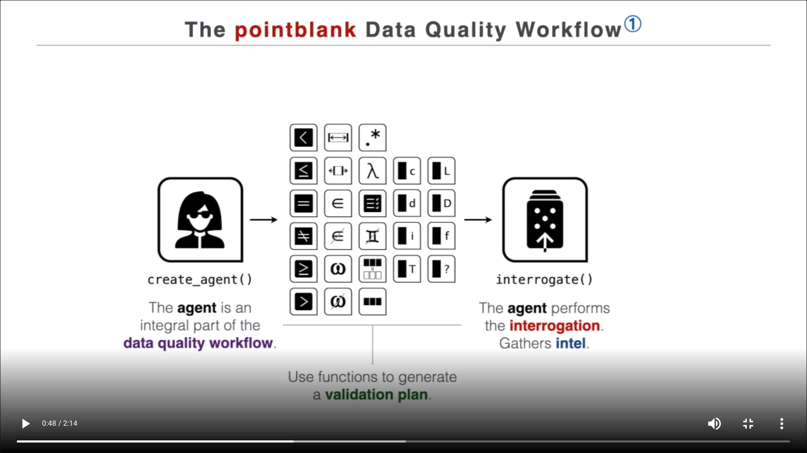
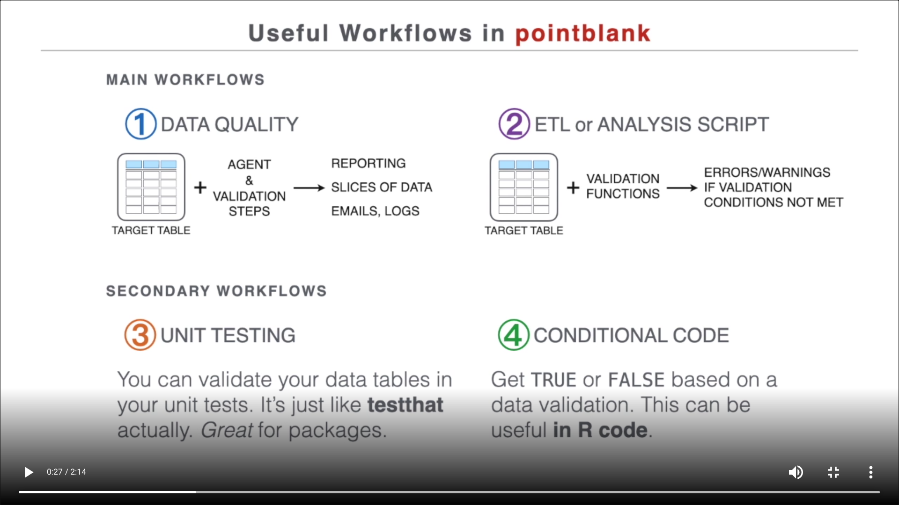

```{r setup, include=FALSE}
knitr::opts_chunk$set(
  eval = TRUE,
  cache = TRUE,
  collapse = TRUE,
  comment = "#>"
)

evaluate <- FALSE
```

# Validating data quality

## The [pointblank](https://rich-iannone.github.io/pointblank/) package



### Demo

Packages

```{r}
library(pointblank)
library(tibble)
```

Data

```{r}
# styler: off
companies <- tibble::tribble(
  ~companies_id,                                 ~information,
              1,    "alpha sells solar panels and wind mills",
              2, "beta sells steel and installs solar panels"
)

categories <- tibble::tribble(
  ~companies_id,      ~sector,
              1,     "energy",
              2, "metallurgy",
              2,     "energy",
              3,     "energy", # Problem!
)
# styler: on
```

Validation

```{r validate = TRUE, eval=evaluate}
agent <- categories |>
  create_agent(actions = action_levels(warn_at = 1, stop_at = 2))

plan <- agent |>
  col_vals_not_null(columns = "companies_id") |>
  col_vals_in_set(columns = "companies_id", set = unique(companies$companies_id)) |>
  col_is_numeric(columns = "companies_id") |>
  rows_distinct(columns = names(categories))

plan |>
  interrogate()
```

### [More workflows](https://rich-iannone.github.io/pointblank/articles/validation_workflows.html)



Helper

```{r}
validate_categories <- function(x) {
  x |>
    col_vals_not_null(columns = "companies_id") |>
    col_vals_in_set(
      columns = "companies_id", 
      set = unique(companies$companies_id),
      actions = action_levels(warn_at = 1)
    ) |>
    col_is_numeric(columns = "companies_id") |>
    rows_distinct(columns = names(categories))
}
```

Main workflows:

* Data quality: Output a validation report

```{r validate = TRUE, eval=evaluate}
categories |> 
  create_agent() |> 
  validate_categories() |> 
  interrogate()
```

* ETL: Output a validated dataset

```{r validate = TRUE, eval=evaluate}
categories |> 
  validate_categories()
```

Secondary workflows: Generally I prefer lower-level, developer oriented tools

* Unit testing

```{r error = TRUE}
data <- tibble(x = "1")

testthat::test_that("is numeric", {
  data |> expect_col_is_numeric("x")
})

testthat::test_that("is numeric", {
  data[["x"]] |> is.numeric() |> testthat::expect_true()
})
```

* Conditional code

```{r}
data |> test_col_is_numeric("x")

data[["x"]] |> is.numeric()
```

### Interfaces for gathering requirements

* [Write an `agent` to yaml](https://rich-iannone.github.io/pointblank/reference/yaml_write.html#writing-an-agent-object-to-a-yaml-file)

```{r}
create_agent(~categories) |> 
  validate_categories() |> 
  yaml_write(filename = "requirements.yml")
```

```{r echo=FALSE, comment = ""}
writeLines(readLines("requirements.yml"))
```

* Use a data dictionary ([example](https://docs.google.com/spreadsheets/d/1WWuwgZXFg2EfnfwBB6oR4JNhykYmRq8kmEoIVsYhafA/edit#gid=1425673786))

```{r echo=FALSE}
vroom::vroom(here::here("data-raw/dictionary.tsv"), show_col_types = FALSE) |> 
  knitr::kable()
```

